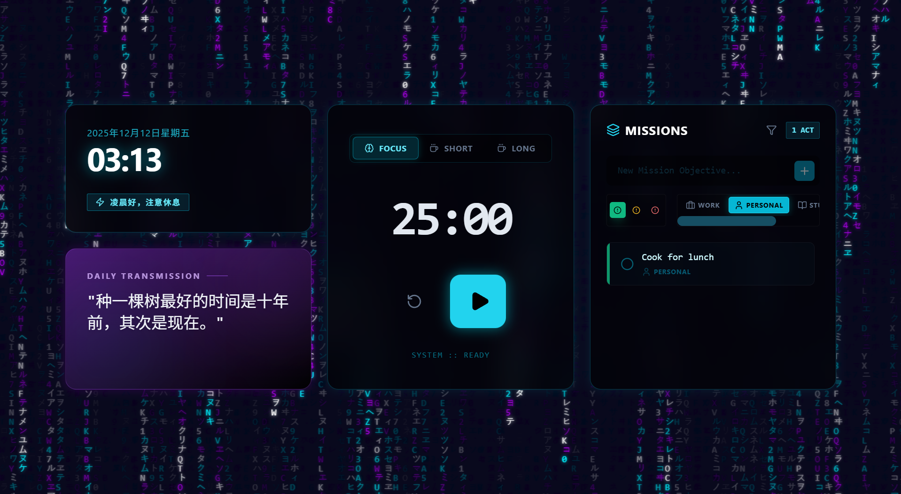

# Focus Flow: Cyberpunk Edition



> **"Wake up, Samurai. We have work to do."**

Focus Flow is a high-fidelity, gamified productivity dashboard designed to turn your daily grind into a cyberpunk mission. Featuring a persistent gamification system, immersive audio-visuals, and advanced task management, it helps you enter the flow state and stay there.

## ✨ New Features (v2.0)

### The "Cyber-Pilot" Gamification System

Productivity meets RPG.

- **Player HUD**: Always-visible status bar tracking your **Level** and **Rank**.
- **XP Progression**: Earn `100 XP` for every focused Pomodoro session and `10 XP` for every mission accomplished.
- **Ranking System**: Climb the ladder from _Initiate_ to _Netrunner_, eventually becoming a _Cyber-Deity_.

### 📟 Mission Control (Advanced Tasks)

Stop writing lists; start executing protocols.

- **Priority Protocols**: Tag missions as **High (Red)**, **Medium (Amber)**, or **Low (Emerald)** priority.
- **Sector Categorization**: Organize missions by **Work**, **Personal**, **Study**, or **Dev**.
- **Smart Filtering**: Toggle visibility to focus on specific sectors.

### 🌌 Immersive Atmosphere

- **Digital Rain**: A custom-built, matrix-style canvas background (Cyan/Magenta).
- **Synthesized Audio**: Built-in `Web Audio API` synthesizer for high-tech UI sounds (no assets required).
- **Neon Glassmorphism**: A deep, dark UI with glowing borders and mono-spaced typography.

## 🛠️ Tech Stack

- **Framework**: [React](https://react.dev/) (v19) + [Vite](https://vitejs.dev/)
- **Styling**: [Tailwind CSS](https://tailwindcss.com/) (Custom Cyberpunk Config)
- **Visuals**: HTML5 Canvas API (Digital Rain)
- **Audio**: Web Audio API (Real-time Synthesis)
- **Icons**: [Lucide React](https://lucide.dev/)

## 🚀 Getting Started

### Prerequisites

Make sure you have Node.js installed on your machine.

### Installation

1. **Clone the repository**

   ```bash
   git clone https://github.com/yourusername/focus-flow.git
   cd focus-flow
   ```

2. **Install dependencies**

   ```bash
   npm install
   ```

3. **Start the development server**

   ```bash
   npm run dev
   ```

4. Open your browser and navigate to `http://localhost:5173`.

## 📁 Project Structure

```
focus-flow/
├── src/
│   ├── components/
│   │   ├── CyberpunkBackground.jsx  # Matrix rain effect
│   │   ├── PlayerHud.jsx           # Gamification display
│   │   ├── PomodoroTimer.jsx       # Focus functionality
│   │   └── TodoList.jsx            # Mission management
│   ├── hooks/
│   │   ├── useGamification.js      # XP/Level logic
│   │   ├── useSound.js             # Audio synthesizer
│   │   ├── useTimer.js             # Timer logic
│   │   └── useTodos.js             # Task state
│   └── App.jsx                     # Mission Control Center
└── ...
```
